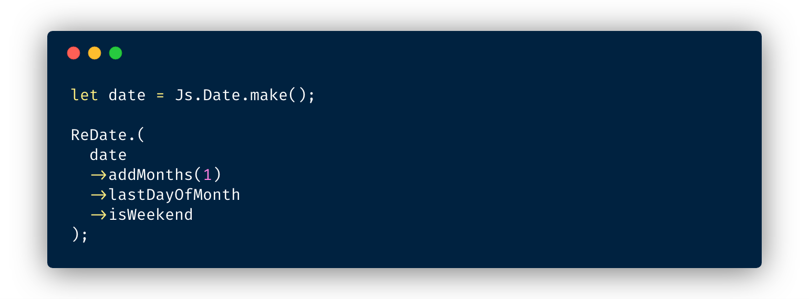

<h1 align="center">
  ReDate
</h1>

<h4 align="center">
  📆 A collection of useful helpers for handling dates in ReasonML with the same modern API as the well-known `date-fns`.
</h4>

<div align="center">
  
</div>

<p align="center">
  <a href="https://travis-ci.com/mobily/re-date">
    
  </a>
  <a href="https://coveralls.io/github/mobily/re-date?branch=master">
    
  </a>
  <a href="https://www.npmjs.com/package/@mobily/re-date">
    
  </a>
  <a href="http://makeapullrequest.com">
    
  </a>
  <a href="#contributors">
    
  </a>
  <a href="https://github.com/mobily/re-date/blob/master/LICENSE">
    
  </a>
</p>

## Motivation

TODO

## Installation

```shell
yarn add @mobily/re-date
```

or with `npm`

```shell
npm install @mobily/re-date --save
```

Then add `@mobily/re-date` to `bs-dependencies` in your `bsconfig.json`:

```json
{
  "bs-dependencies": [
    "@mobily/re-date"
  ]
}
```

## Api Reference

If you are familiar with `date-fns`, then you already know how to use `ReDate`.

**The list of helpers:**

<!-- TOC:START - Do not remove or modify this section -->
<details>
<summary><code>Common</code></summary>

* [isEqual](docs/common.md#isequal)
* [isBefore](docs/common.md#isbefore)
* [isAfter](docs/common.md#isafter)
* [isFuture](docs/common.md#isfuture)
* [isPast](docs/common.md#ispast)
* [compareAsc](docs/common.md#compareasc)
* [compareDesc](docs/common.md#comparedesc)
* [maxOfArray](docs/common.md#maxofarray)
* [maxOfList](docs/common.md#maxoflist)
* [minOfArray](docs/common.md#minofarray)
* [minOfList](docs/common.md#minoflist)
* [isValid](docs/common.md#isvalid)
</details>

<details>
<summary><code>Interval</code></summary>

* [isWithinInterval](docs/interval.md#iswithininterval)
* [areIntervalsOverlapping](docs/interval.md#areintervalsoverlapping)
* [getOverlappingDaysInIntervals](docs/interval.md#getoverlappingdaysinintervals)
* [eachDayOfIntervalArray](docs/interval.md#eachdayofintervalarray)
* [eachDayOfIntervalList](docs/interval.md#eachdayofintervallist)
</details>

<details>
<summary><code>Second</code></summary>

* [addSeconds](docs/second.md#addseconds)
* [subSeconds](docs/second.md#subseconds)
* [differenceInSeconds](docs/second.md#differenceinseconds)
* [startOfSecond](docs/second.md#startofsecond)
* [endOfSecond](docs/second.md#endofsecond)
* [isSameSecond](docs/second.md#issamesecond)
</details>

<details>
<summary><code>Minute</code></summary>

* [addMinutes](docs/minute.md#addminutes)
* [subMinutes](docs/minute.md#subminutes)
* [differenceInMinutes](docs/minute.md#differenceinminutes)
* [startOfMinute](docs/minute.md#startofminute)
* [endOfMinute](docs/minute.md#endofminute)
* [isSameMinute](docs/minute.md#issameminute)
* [roundToNearestMinute](docs/minute.md#roundtonearestminute)
</details>

<details>
<summary><code>Hour</code></summary>

* [addHours](docs/hour.md#addhours)
* [subHours](docs/hour.md#subhours)
* [differenceInHours](docs/hour.md#differenceinhours)
* [startOfHour](docs/hour.md#startofhour)
* [endOfHour](docs/hour.md#endofhour)
* [isSameHour](docs/hour.md#issamehour)
</details>

<details>
<summary><code>Day</code></summary>

* [addDays](docs/day.md#adddays)
* [subDays](docs/day.md#subdays)
* [startOfDay](docs/day.md#startofday)
* [endOfDay](docs/day.md#endofday)
* [differenceInCalendarDays](docs/day.md#differenceincalendardays)
* [differenceInDays](docs/day.md#differenceindays)
* [getDayOfYear](docs/day.md#getdayofyear)
* [isSameDay](docs/day.md#issameday)
* [isToday](docs/day.md#istoday)
* [isTomorrow](docs/day.md#istomorrow)
* [isYesterday](docs/day.md#isyesterday)
</details>

<details>
<summary><code>Week</code></summary>

* [addWeeks](docs/week.md#addweeks)
* [subWeeks](docs/week.md#subweeks)
* [differenceInWeeks](docs/week.md#differenceinweeks)
* [differenceInCalendarWeeks](docs/week.md#differenceincalendarweeks)
* [startOfWeek](docs/week.md#startofweek)
* [endOfWeek](docs/week.md#endofweek)
* [isSameWeek](docs/week.md#issameweek)
* [lastDayOfWeek](docs/week.md#lastdayofweek)
* [getWeekOfMonth](docs/week.md#getweekofmonth)
* [getWeeksInMonth](docs/week.md#getweeksinmonth)
</details>

<details>
<summary><code>Weekday</code></summary>

* [isSunday](docs/weekday.md#issunday)
* [isMonday](docs/weekday.md#ismonday)
* [isTuesday](docs/weekday.md#istuesday)
* [isWednesday](docs/weekday.md#iswednesday)
* [isThursday](docs/weekday.md#isthursday)
* [isFriday](docs/weekday.md#isfriday)
* [isSaturday](docs/weekday.md#issaturday)
* [isWeekend](docs/weekday.md#isweekend)
</details>

<details>
<summary><code>Month</code></summary>

* [addMonths](docs/month.md#addmonths)
* [subMonths](docs/month.md#submonths)
* [differenceInCalendarMonths](docs/month.md#differenceincalendarmonths)
* [differenceInMonths](docs/month.md#differenceinmonths)
* [startOfMonth](docs/month.md#startofmonth)
* [endOfMonth](docs/month.md#endofmonth)
* [isFirstDayOfMonth](docs/month.md#isfirstdayofmonth)
* [isLastDayOfMonth](docs/month.md#islastdayofmonth)
* [isSameMonth](docs/month.md#issamemonth)
* [lastDayOfMonth](docs/month.md#lastdayofmonth)
* [getDaysInMonth](docs/month.md#getdaysinmonth)
</details>

<details>
<summary><code>Year</code></summary>

* [addYears](docs/year.md#addyears)
* [subYears](docs/year.md#subyears)
* [startOfYear](docs/year.md#startofyear)
* [endOfYear](docs/year.md#endofyear)
* [isSameYear](docs/year.md#issameyear)
* [isLeapYear](docs/year.md#isleapyear)
* [lastMonthOfYear](docs/year.md#lastmonthofyear)
* [lastDayOfYear](docs/year.md#lastdayofyear)
* [getDaysInYear](docs/year.md#getdaysinyear)
* [differenceInCalendarYears](docs/year.md#differenceincalendaryears)
* [differenceInYears](docs/year.md#differenceinyears)
</details>

<!-- TOC:END -->

## Status

Check the current status [here](STATUS.md).

## Contributors

<!-- ALL-CONTRIBUTORS-LIST:START - Do not remove or modify this section -->
<!-- prettier-ignore -->
| [<br /><sub><b>Marcin Dziewulski</b></sub>](https://twitter.com/__marcin_)<br />[💻](https://github.com/mobily/re-date/commits?author=mobily "Code") [📖](https://github.com/mobily/re-date/commits?author=mobily "Documentation") | [<br /><sub><b>Radek Kozieł</b></sub>](http://radoslawkoziel.pl)<br />[💻](https://github.com/mobily/re-date/commits?author=panr "Code") |
| :---: | :---: |
<!-- ALL-CONTRIBUTORS-LIST:END -->

This project follows the [all-contributors](https://github.com/kentcdodds/all-contributors) specification. Contributions of any kind welcome!

## License

The MIT License.

See [LICENSE](LICENSE)
